### Base R Version

#### Data
Let us begin by simulating our sample data of 3 factor variables and 4 numeric variables.


```r
## Simulate some data

## 3 Factor Variables
FacVar1 = as.factor(rep(c("level1", "level2"), 25))
FacVar2 = as.factor(rep(c("levelA", "levelB", "levelC"), 17)[-51])
FacVar3 = as.factor(rep(c("levelI", "levelII", "levelIII", "levelIV"), 13)[-c(51:52)])

## 4 Numeric Vars
set.seed(123)
NumVar1 = round(rnorm(n = 50, mean = 1000, sd = 50), digits = 2)  ## Normal distribution
set.seed(123)
NumVar2 = round(runif(n = 50, min = 500, max = 1500), digits = 2)  ## Uniform distribution
set.seed(123)
NumVar3 = round(rexp(n = 50, rate = 0.001))  ## Exponential distribution
NumVar4 = 2001:2050

simData = data.frame(FacVar1, FacVar2, FacVar3, NumVar1, NumVar2, NumVar3, NumVar4)
```


#### One Variable: Numeric Variable


```r
plot(simData$NumVar1, type = "o")  ## Index plot
```

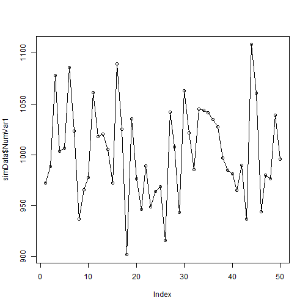 

```r
hist(simData$NumVar1)  ## histogram
```

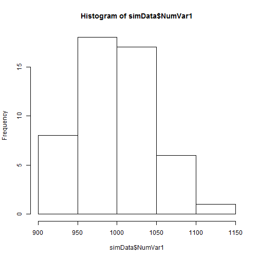 

```r
plot(density(simData$NumVar1))  ## Kernel density plot
```

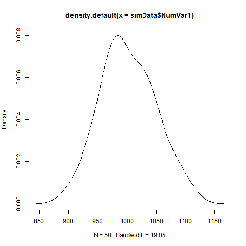 

```r
boxplot(simData$NumVar1)  ## box plot
```

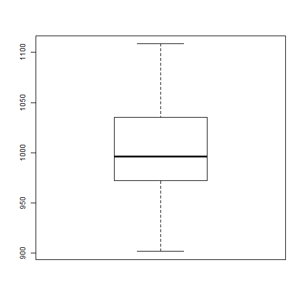 


#### One Variable: Factor Variable


```r
plot(simData$FacVar3)  ## bar plot
```

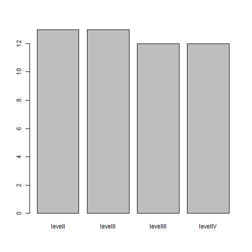 

```r

## pie chart - Not the best graph --- use with caution
counts = table(simData$FacVar3)  ## get counts
labs = paste(simData$FacVar3, counts)  ## create labels
pie(counts, labels = labs)  ## plot
```

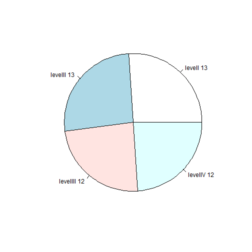 


#### Two Variables: Two Numeric Variables

```r
plot(simData$NumVar1, type = "o", ylim = c(0, max(simData$NumVar1, simData$NumVar2)))  ## index plot with one variable
lines(simData$NumVar2, type = "o", lty = 2, col = "red")  ## add another variable
```

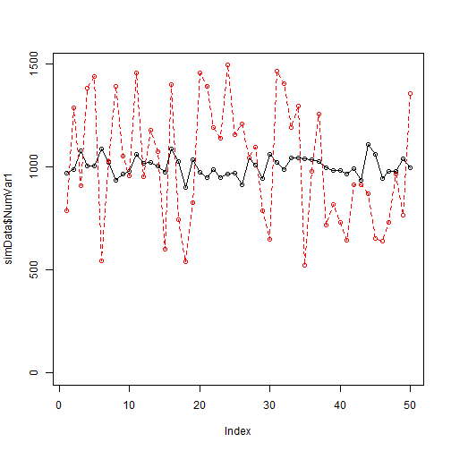 

```r

## Let's draw density plots :
## https://stat.ethz.ch/pipermail/r-help/2006-August/111865.html
dv1 = density(simData$NumVar1)
dv2 = density(simData$NumVar2)
plot(range(dv1$x, dv2$x), range(dv1$y, dv2$y), type = "n", xlab = "NumVar1(red) and NumVar2 (blue)", 
    ylab = "Density")
lines(dv1, col = "red")
lines(dv2, col = "blue")
```

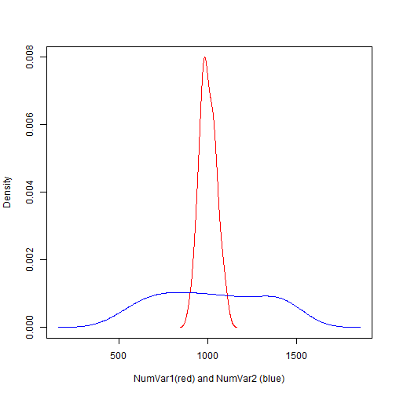 

```r

## scatterplots
plot(simData$NumVar1, simData$NumVar2)
```

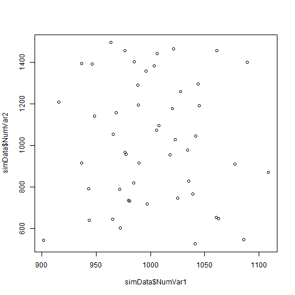 


#### Two Variables: Two Factor Variables

```r
## Mosaic plot
plot(table(simData$FacVar2, simData$FacVar3))
```

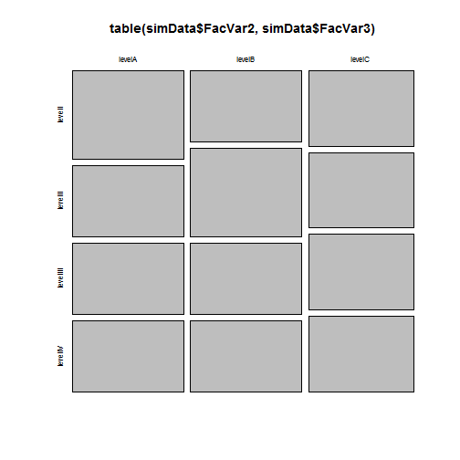 

```r

## barplots
bartable = table(simData$FacVar2, simData$FacVar3)  ## get the cross tab
barplot(bartable, beside = TRUE, legend = levels(unique(simData$FacVar2)))  ## plot 
```

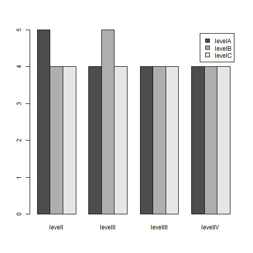 

```r
barplot(bartable, legend = levels(unique(simData$FacVar2)))  ## stacked
```

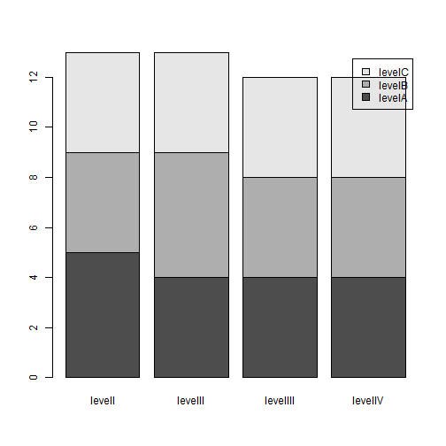 

```r
barplot(prop.table(bartable, 2) * 100, legend = levels(unique(simData$FacVar2)))  ## stacked 100%
```

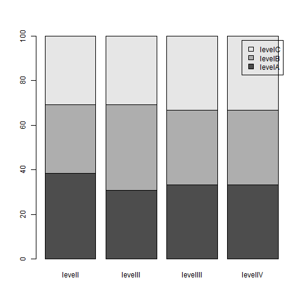 


#### Two Variables: One Factor and One Numeric

```r
## Box plots for the numeric var over the levels of the factor var
plot(simData$FacVar1, simData$NumVar1)
```

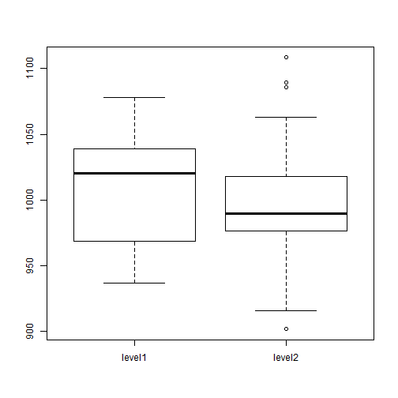 

```r

## density plot of numeric var across multiple levels of the factor var
level1 = simData[simData$FacVar1 == "level1", ]
level2 = simData[simData$FacVar1 == "level2", ]

dv3 = density(level1$NumVar1)
dv4 = density(level2$NumVar1)

plot(range(dv3$x, dv4$x), range(dv3$y, dv4$y), type = "n", xlab = "NumVar1 at Level1 (red) and NumVar1 at Level2 (blue)", 
    ylab = "Density")
lines(dv3, col = "red")
lines(dv4, col = "blue")
```

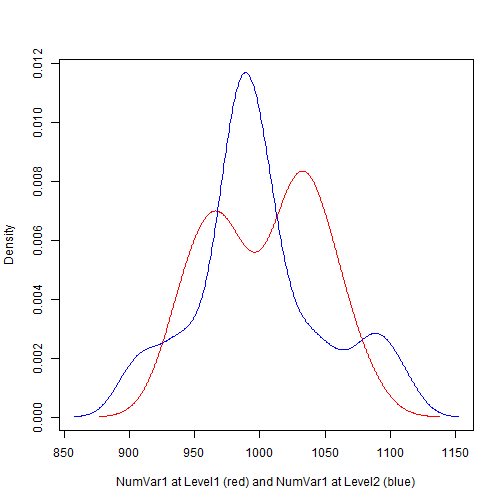 

```r

## Mean of one numeric var over levels of one factor var
meanagg = aggregate(simData$NumVar1, list(simData$FacVar3), mean)

dotchart(meanagg$x, labels = meanagg$Group.1)  ## Dot Chart 
```

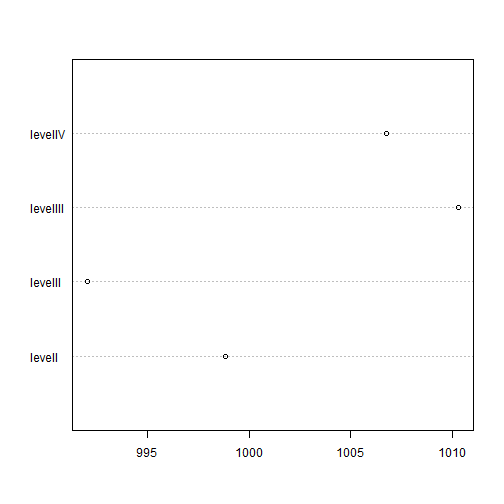 

```r
barplot(meanagg$x, names.arg = meanagg$Group.1)  ## Bar plot 
```

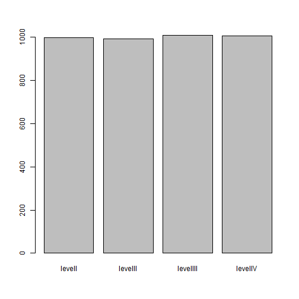 

```r
## Question: Is a bar plot even appropriate when displaying a mean--- a
## point?
```


#### Three Variables: Three Factor Variables


```r
par(mfrow = c(1, 2))

bar1table = table(level1$FacVar2, level1$FacVar3)
barplot(bar1table, beside = TRUE, main = "FacVar1=level1")

bar2table = table(level2$FacVar2, level2$FacVar3)
barplot(bar2table, beside = TRUE, main = "FacVar1=level2", legend = levels(unique(level2$FacVar2)))
```

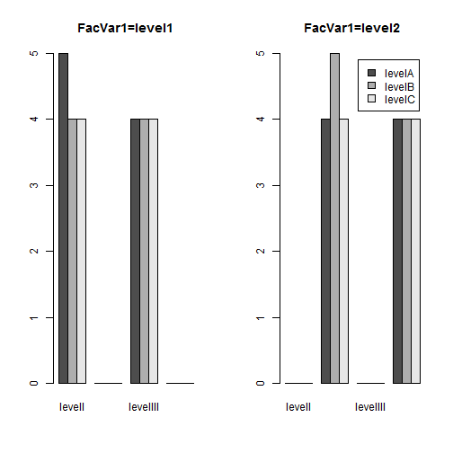 


#### Three Variables: One Numeric and Two Factor Variables

```r
par(mfrow = c(1, 1))
## boxplot of NumVar1 over an interaction of 6 levels of the combination of
## FacVar1 and FacVar2
boxplot(NumVar1 ~ interaction(FacVar1, FacVar2), data = simData)
```

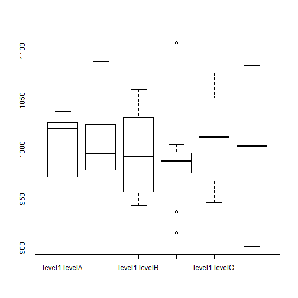 

```r

## Mean of 1 Numeric over levels of two factor vars
meanaggg = aggregate(simData$NumVar1, list(simData$FacVar1, simData$FacVar2), 
    mean)
meanaggg = meanaggg[order(meanaggg$Group.1), ]
meanaggg$color[meanaggg$Group.2 == "levelA"] = "red"
meanaggg$color[meanaggg$Group.2 == "levelB"] = "blue"
meanaggg$color[meanaggg$Group.2 == "levelC"] = "darkgreen"

dotchart(meanaggg$x, labels = meanaggg$Group.2, groups = meanaggg$Group.1, color = meanaggg$color)  ## dotchart
```

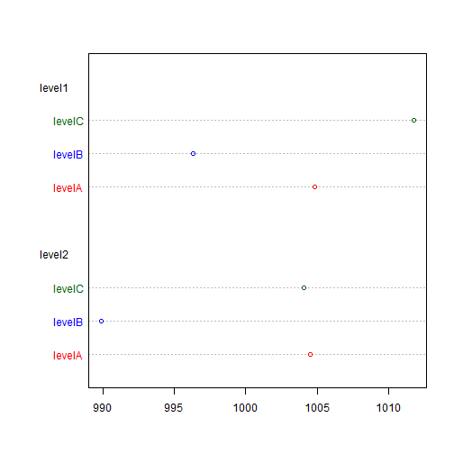 

```r

interaction.plot(meanaggg$Group.2, meanaggg$Group.1, meanaggg$x, type = "b", 
    col = c(1:2), pch = c(18, 24))  ## interaction plot - line plots of means
```

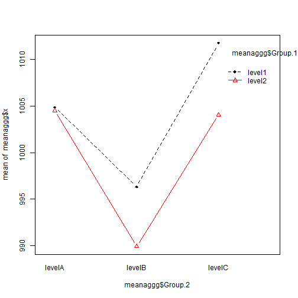 

```r

## some a bar plot
par(mfrow = c(1, 2))

level1 = meanaggg[meanaggg$Group.1 == "level1", ]
level2 = meanaggg[meanaggg$Group.1 == "level2", ]

barplot(level1$x, names.arg = level1$Group.2, main = "FacVar1=level1")
barplot(level2$x, names.arg = level2$Group.2, main = "FacVar1=level2")
```

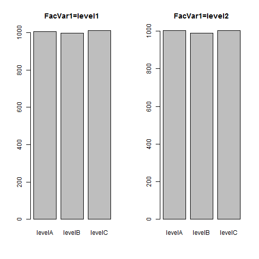 


#### Three Variables: Two Numeric and One Factor Variables


```r
## Scatter plot with color identifying the factor variable
par(mfrow = c(1, 1))
plot(simData$NumVar1, simData$NumVar2, col = simData$FacVar1)
legend("topright", levels(simData$FacVar1), fill = simData$FacVar1)
```

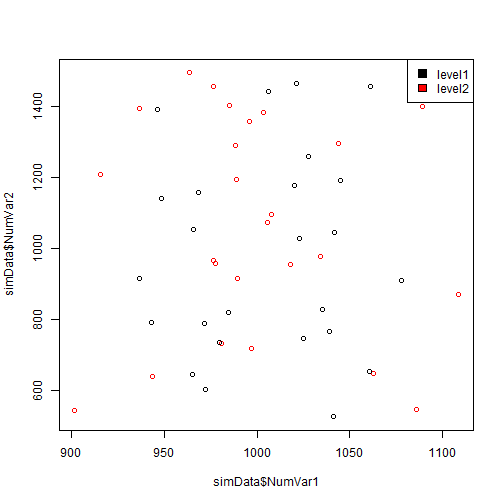 


#### Three Variables: Three Numeric Variables 


```r
## NumVar4 is 2001 through 2050... possibly, a time variable - use that as
## the x-axis
plot(simData$NumVar4, simData$NumVar1, type = "o", ylim = c(0, max(simData$NumVar1, 
    simData$NumVar2)))  ## join dots with lines

lines(simData$NumVar4, simData$NumVar2, type = "o", lty = 2, col = "red")  ## add another line
```

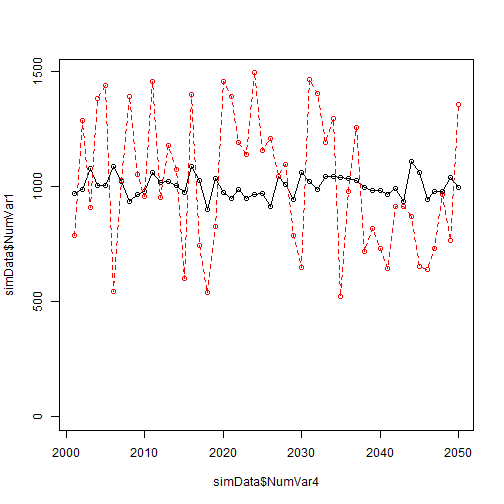 

```r

## Bubble plot - scatter plot of NumVar1 and NumVar2 with individual
## observations sized by NumVar3
## http://flowingdata.com/2010/11/23/how-to-make-bubble-charts/
radius <- sqrt(simData$NumVar3/pi)
symbols(simData$NumVar1, simData$NumVar2, circles = radius, inches = 0.25, fg = "white", 
    bg = "red", main = "Sized by NumVar3")
```

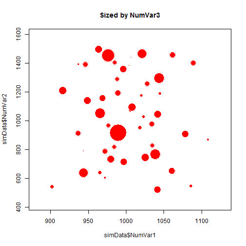 


#### Scatterplot Matrix of all Numeric Vars, colored by a Factor variable

```r
pairs(simData[, 4:7], col = simData$FacVar1)
```

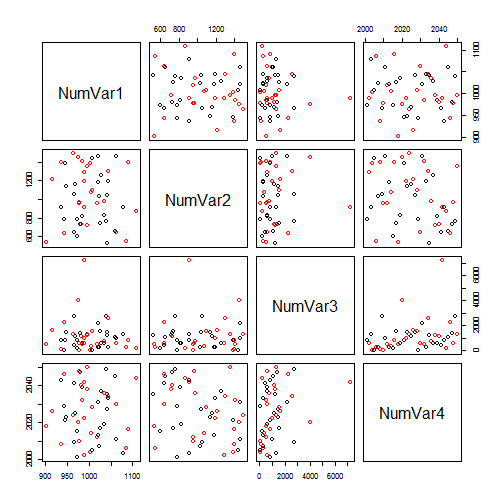 


#### References

Besides the link from flowingdata.com referred to in the context of the bubble plot, additional websites were used as references. 
http://www.harding.edu/fmccown/r/
http://www.statmethods.net/
