### ggplot2 Version

#### Data

Let us begin by simulating our sample data of 3 factor variables and 4 numeric variables. 


```r
## Simulate some data

## 3 Factor Variables
FacVar1 = as.factor(rep(c("level1", "level2"), 25))
FacVar2 = as.factor(rep(c("levelA", "levelB", "levelC"), 17)[-51])
FacVar3 = as.factor(rep(c("levelI", "levelII", "levelIII", "levelIV"), 13)[-c(51:52)])

## 4 Numeric Vars
set.seed(123)
NumVar1 = round(rnorm(n = 50, mean = 1000, sd = 50), digits = 2)  ## Normal distribution
set.seed(123)
NumVar2 = round(runif(n = 50, min = 500, max = 1500), digits = 2)  ## Uniform distribution
set.seed(123)
NumVar3 = round(rexp(n = 50, rate = 0.001))  ## Exponential distribution
NumVar4 = 2001:2050

simData = data.frame(FacVar1, FacVar2, FacVar3, NumVar1, NumVar2, NumVar3, NumVar4)
```


#### Initialize the libraries used for this page

```r
library(ggplot2)
library(reshape2)
```


#### One Variable: Numeric Variable


```r

ggplot(simData, aes(y = NumVar1, x = 1:nrow(simData), group = "NumVar1")) + 
    geom_point() + geom_line() + xlab("")  ## Index plot 
```

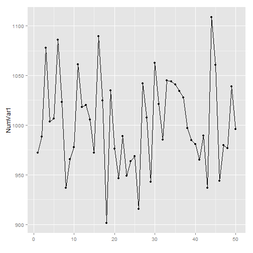 

```r
ggplot(simData, aes(x = NumVar1)) + geom_histogram()  ## histogram
```

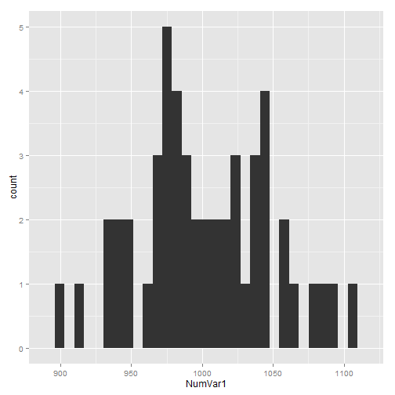 

```r
ggplot(simData, aes(x = NumVar1)) + geom_density()  ## Kernel density plot
```

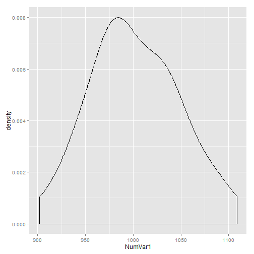 

```r
ggplot(simData, aes(x = factor(""), y = NumVar1)) + geom_boxplot() + xlab("")  ## box plot
```

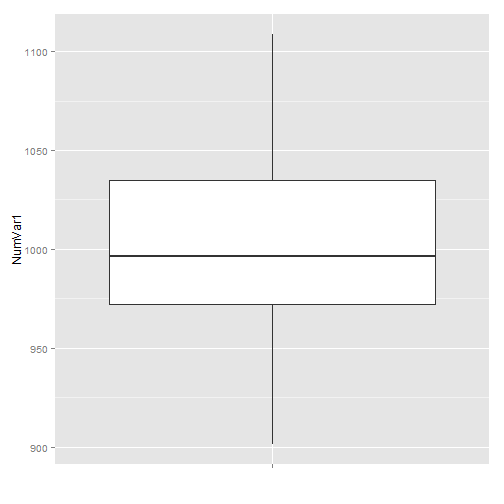 


#### One Variable: Factor Variable


```r

## barplot
ggplot(simData, aes(x = FacVar3)) + geom_bar()
```

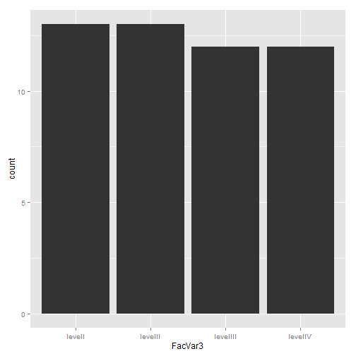 

```r

## pie chart - Not the best graph --- use with caution
ggplot(simData, aes(x = factor(""), fill = FacVar3, label = FacVar3)) + geom_bar() + 
    coord_polar(theta = "y") + scale_x_discrete("")
```

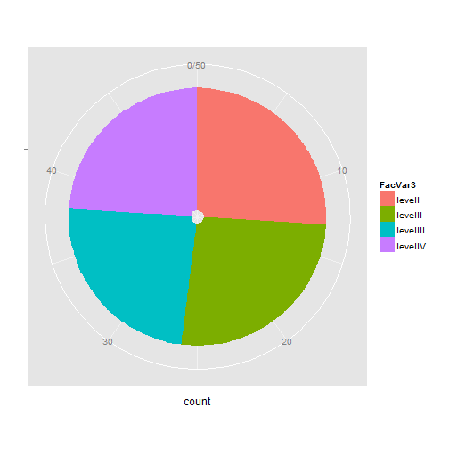 


#### Two Variables: Two Numeric Variables


```r
simtmp = simData[, c(4:5)]  ## 4th and 5th columns are NumVar1 and NumVar2
simtmp$index = 1:nrow(simtmp)
simtmpmelt = melt(simtmp, id = c("index"))

## line plots with observation number as index
ggplot(simtmpmelt, aes(y = value, x = index, color = variable)) + geom_point() + 
    geom_line() + xlab("")
```

 

```r

## Let's draw density functions for NumVar1 & NumVar2
ggplot(simtmpmelt, aes(x = value, color = variable)) + geom_density()
```

 

```r

## scatter plot
ggplot(simData, aes(x = NumVar1, y = NumVar2)) + geom_point()
```

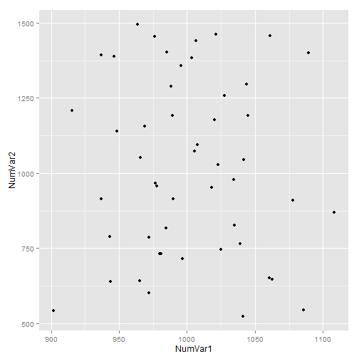 


#### Two Variables: Two Factor Variables

```r
## Mosaic plot: ggMMplot function - thanks to Edwin on Stackoverflow:
## http://stackoverflow.com/questions/19233365/how-to-create-a-marimekko-mosaic-plot-in-ggplot2

ggMMplot <- function(var1, var2) {
    require(ggplot2)
    levVar1 <- length(levels(var1))
    levVar2 <- length(levels(var2))
    
    jointTable <- prop.table(table(var1, var2))
    plotData <- as.data.frame(jointTable)
    plotData$marginVar1 <- prop.table(table(var1))
    plotData$var2Height <- plotData$Freq/plotData$marginVar1
    plotData$var1Center <- c(0, cumsum(plotData$marginVar1)[1:levVar1 - 1]) + 
        plotData$marginVar1/2
    
    ggplot(plotData, aes(var1Center, var2Height)) + geom_bar(stat = "identity", 
        aes(width = marginVar1, fill = var2), col = "Black") + geom_text(aes(label = as.character(var1), 
        x = var1Center, y = 1.05))
}
ggMMplot(simData$FacVar2, simData$FacVar3)
```

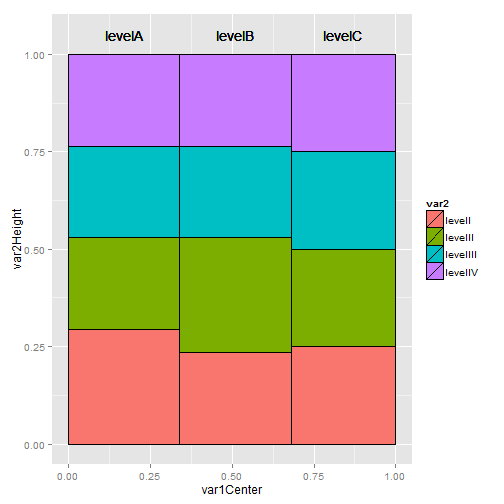 

```r

## barplots

bartabledat = as.data.frame(table(simData$FacVar2, simData$FacVar3))  ## get the cross tab
ggplot(bartabledat, aes(x = Var2, y = Freq, fill = Var1)) + geom_bar(position = "dodge")  ## plot
```

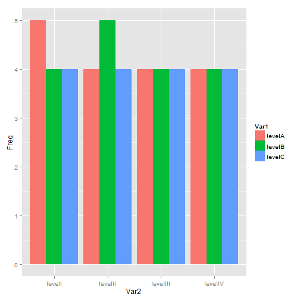 

```r
ggplot(bartabledat, aes(x = Var2, y = Freq, fill = Var1)) + geom_bar()  ## stacked
```

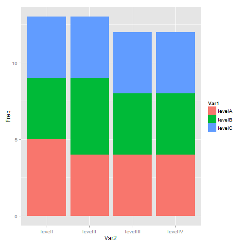 

```r
bartableprop = as.data.frame(prop.table(table(simData$FacVar2, simData$FacVar3), 
    2) * 100)
ggplot(bartableprop, aes(x = Var2, y = Freq, fill = Var1)) + geom_bar()  ## Stacked 100% 
```

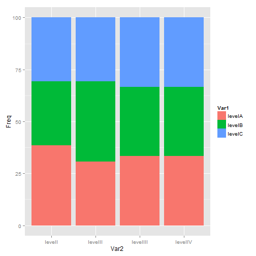 


#### Two Variables: One Factor and One Numeric


```r
## Box plots for the numeric var over the levels of the factor var
ggplot(simData, aes(x = FacVar1, y = NumVar1)) + geom_boxplot()
```

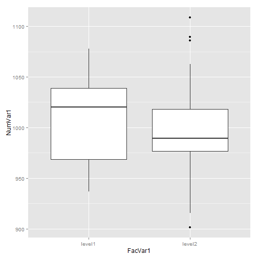 

```r

## density plot of numeric var across multiple levels of the factor var
ggplot(simData, aes(x = NumVar1, color = FacVar1)) + geom_density()
```

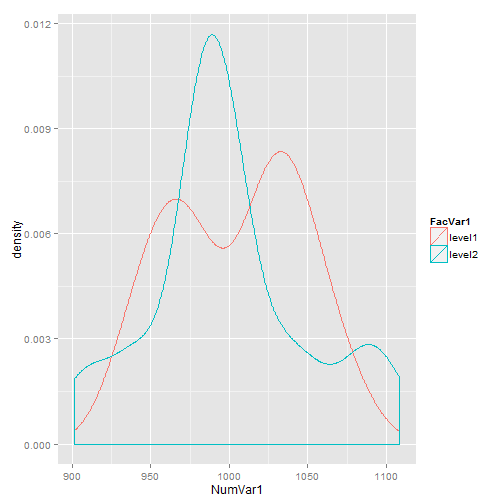 

```r

## Mean of one numeric var over levels of one factor var
meanagg = aggregate(simData$NumVar1, list(simData$FacVar3), mean)
ggplot(meanagg, aes(x = Group.1, y = x)) + geom_point() + coord_flip()  ## Dot Chart equivalent
```

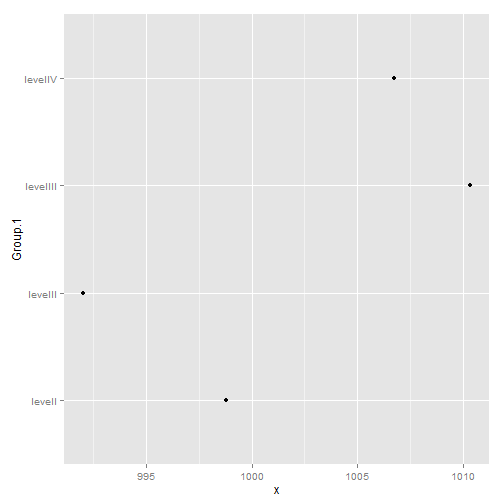 

```r
ggplot(meanagg, aes(x = Group.1, y = x)) + geom_bar()  ## Bar plot
```

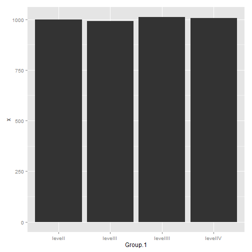 


#### Three Variables: Three Factor Variables


```r
Threebartable = as.data.frame(table(simData$FacVar1, simData$FacVar2, simData$FacVar3))  ## CrossTab
ggplot(Threebartable, aes(x = Var3, y = Freq, fill = Var2)) + geom_bar(position = "dodge") + 
    facet_wrap(~Var1)  ## Bar plot with facetting
```

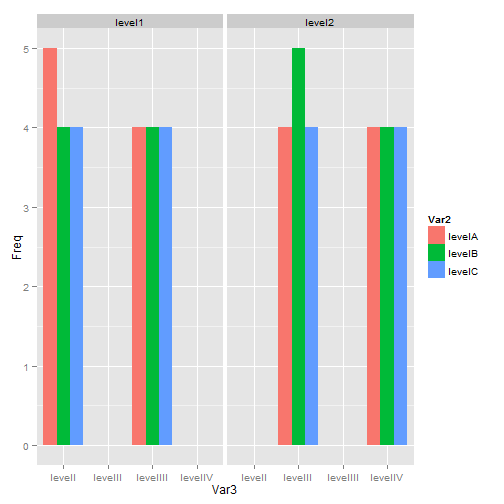 


#### Three Variables: One Numeric and Two Factor Variables

```r
## boxplot of NumVar1 over an interaction of 6 levels of the combination of
## FacVar1 and FacVar2
ggplot(simData, aes(x = FacVar2, y = NumVar1, fill = FacVar1)) + geom_boxplot()
```

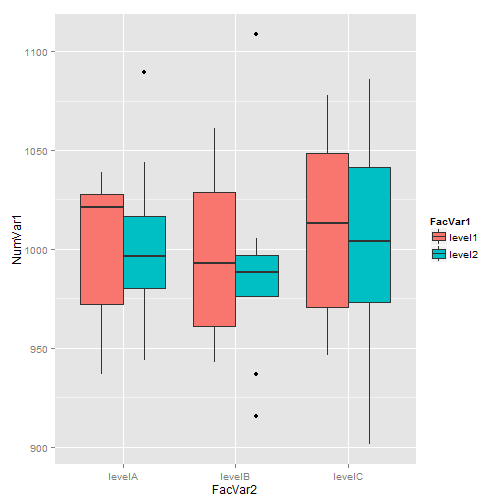 

```r

## Mean of 1 Numeric over levels of two factor vars
meanaggg = aggregate(simData$NumVar1, list(simData$FacVar1, simData$FacVar2), 
    mean)
## Dot Chart equivalent
ggplot(meanaggg, aes(x = Group.2, y = x, color = Group.2)) + geom_point() + 
    coord_flip() + facet_wrap(~Group.1, ncol = 1)
```

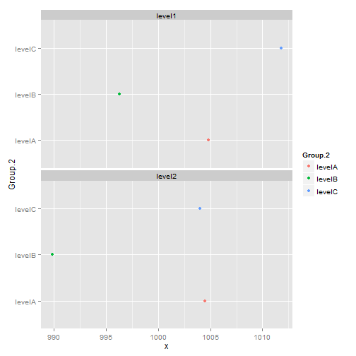 

```r

## Interaction chart - line chart
ggplot(meanaggg, aes(x = Group.2, y = x, color = Group.1, group = Group.1)) + 
    geom_point() + geom_line()
```

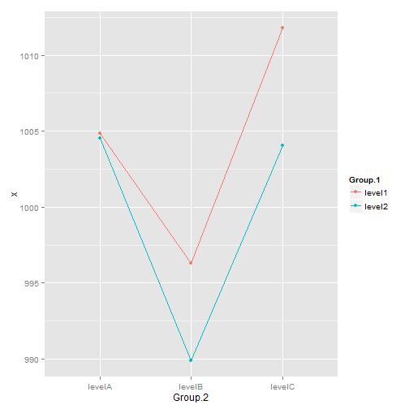 

```r

## And bar plot
ggplot(meanaggg, aes(x = Group.2, y = x)) + geom_bar() + facet_wrap(~Group.1)
```

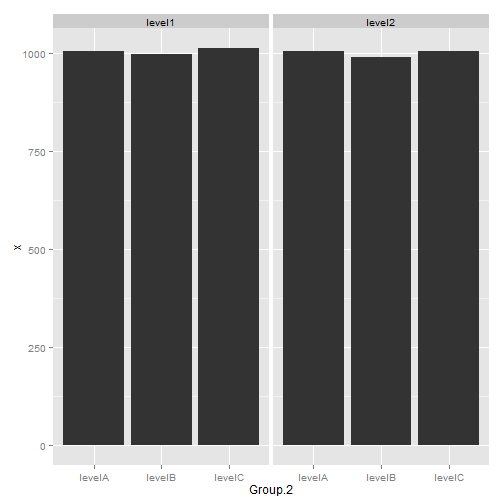 


#### Three Variables: Two Numeric and One Factor Variables


```r
## Scatter plot with color identifying the factor variable
ggplot(simData, aes(x = NumVar1, y = NumVar2, color = FacVar1)) + geom_point()
```

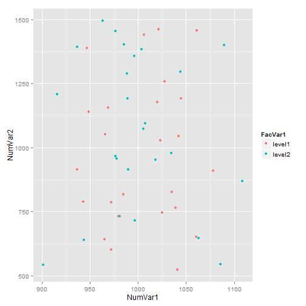 


#### Three Variables: Three Numeric Variables 


```r
## NumVar4 is 2001 through 2050... possibly, a time variable - use that as
## the x-axis
simtmpp = simData[, c(4, 5, 7)]
simtmppmelt = melt(simtmpp, id = c("NumVar4"))
ggplot(simtmppmelt, aes(x = NumVar4, y = value, color = variable, group = variable)) + 
    geom_point() + geom_line()
```

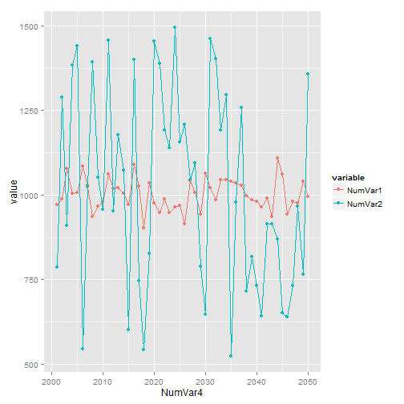 

```r

## Extra: Stacked Area Graph
ggplot(simtmppmelt, aes(x = NumVar4, y = value, fill = variable)) + geom_area(position = "stack")
```

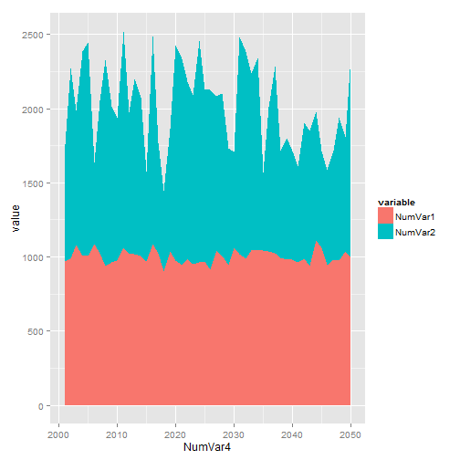 

```r

## Extra: 100% stacked area graph
ggplot(simtmppmelt, aes(x = NumVar4, y = value, fill = variable)) + geom_area(position = "fill")
```

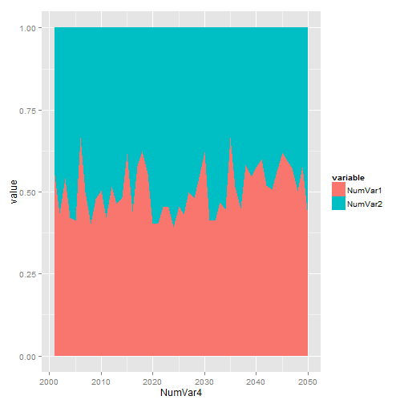 

```r

## ## Bubble plot - scatter plot of NumVar1 and NumVar2 with individual
## observations sized by NumVar3
ggplot(simData, aes(x = NumVar1, y = NumVar2, size = NumVar3)) + geom_point()
```

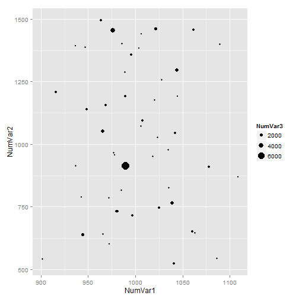 


#### Scatterplot Matrix of all Numeric Vars, colored by a Factor variable

```r
# Thanks to Gaston Sanchez for the function:
# http://gastonsanchez.wordpress.com/2012/08/27/scatterplot-matrices-with-ggplot/
makePairs <- function(data) {
    grid <- expand.grid(x = 1:ncol(data), y = 1:ncol(data))
    grid <- subset(grid, x != y)
    all <- do.call("rbind", lapply(1:nrow(grid), function(i) {
        xcol <- grid[i, "x"]
        ycol <- grid[i, "y"]
        data.frame(xvar = names(data)[ycol], yvar = names(data)[xcol], x = data[, 
            xcol], y = data[, ycol], data)
    }))
    all$xvar <- factor(all$xvar, levels = names(data))
    all$yvar <- factor(all$yvar, levels = names(data))
    densities <- do.call("rbind", lapply(1:ncol(data), function(i) {
        data.frame(xvar = names(data)[i], yvar = names(data)[i], x = data[, 
            i])
    }))
    list(all = all, densities = densities)
}

## expanding numeric columns for pairs plot
gg1 = makePairs(simData[, 4:7])

## new data frame
simDatabig = data.frame(gg1$all, simData[, 1:3])

## pairs plot
ggplot(simDatabig, aes_string(x = "x", y = "y")) + facet_grid(xvar ~ yvar, scales = "free") + 
    geom_point(aes(colour = FacVar2), na.rm = TRUE) + stat_density(aes(x = x, 
    y = ..scaled.. * diff(range(x)) + min(x)), data = gg1$densities, position = "identity", 
    colour = "grey20", geom = "line")
```

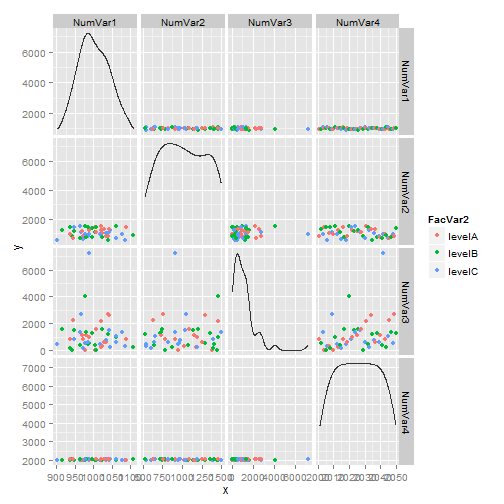 

#### References

Besides the link to Edwin's response from Stackoverflow and Gaston Sanchez's site referred to above, other resources used and useful for ggplot2 include the following.
http://docs.ggplot2.org/0.9.3.1/
Hadley Wickham's ggplot2 book
Winston Chang's book: R Graphics Cookbook: http://www.cookbook-r.com/Graphs/
